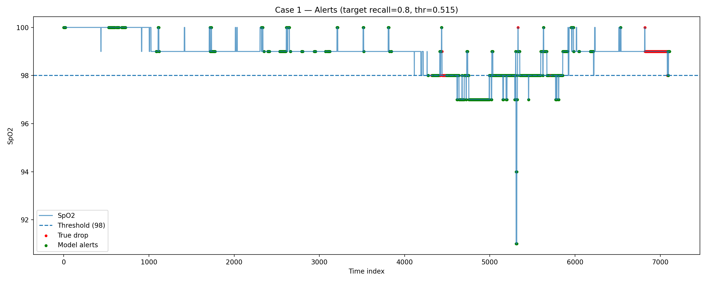
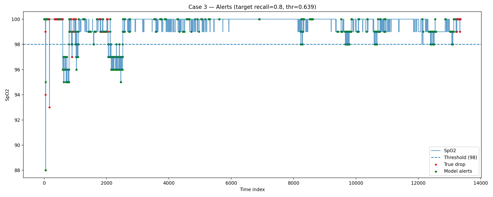
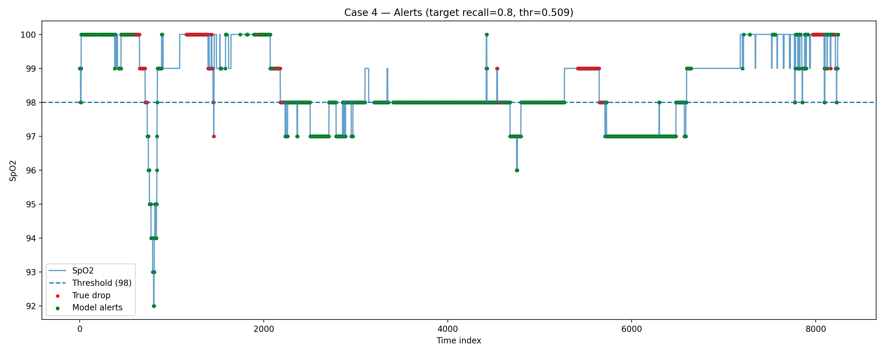

# Telemonitoring AI Pipeline — Early Warning for SpO2 Drop

## English

### Overview
This project implements an end-to-end telemonitoring pipeline to **predict upcoming oxygen desaturation** from vital-sign time series.

**Binary early-warning task**
- **Event**: SpO2 will drop below **98** within the next **5 minutes**
- **Features**: rolling-window statistics from the last **60 seconds** + short-term features to capture **fast drops**
- **Model**: Gradient Boosting (tree-based)
- **Decision rule**: choose a probability threshold by targeting a desired recall on the training set (default: **0.80**)

### Dataset
UQ Vital Signs Dataset (case01–case32).  
This repository **does not include raw data**.

Expected local structure:
data/uq-vitalsigns/uqvitalsignsdata/
case01/
case02/
...

### Reproducible pipeline
Scripts in `src/`:
- `evaluate.py`: multi-case evaluation (leave-one-case-out style on a small case list)
- `visualize.py`: plot SpO2 + true drops + model alerts for a selected case

Outputs:
- `results/metrics/summary_cases.json`
- `results/metrics/summary_by_target.json`
- `results/figures/caseXX_alerts.png`

### How to run
1) Activate environment and install dependencies
```bash
conda activate telemed
pip install -r requirements.txt


1.Set the dataset path in src/config.py (DATA_ROOT)


2.Run evaluation

python -m src.evaluate --cases 1 2 3 4 5 --target-recall 0.80

1.Generate visualizations

python -m src.visualize --case 1 --target-recall 0.80
python -m src.visualize --case 3 --target-recall 0.80
python -m src.visualize --case 4 --target-recall 0.80


Notes:
Some CSV rows can be malformed (extra delimiters). We use engine="python" and skip bad lines.
Some cases may become single-class under the chosen event definition and are skipped during evaluation.


## Deutsch
## Überblick
Dieses Projekt implementiert eine vollständige Telemonitoring-Pipeline zur Vorhersage einer bevorstehenden Sauerstoff-Entsättigung aus Vitaldaten-Zeitreihen.
Binäre Frühwarn-Aufgabe

Ereignis: SpO2 fällt innerhalb der nächsten 5 Minuten unter 98
Merkmale: Statistik-Merkmale aus den letzten 60 Sekunden + Kurzzeit-Merkmale für schnelle Abfälle
Modell: Gradient Boosting (baum-basiert)
Entscheidung: Schwellenwert so wählen, dass im Training ein gewünschter Recall erreicht wird (Standard: 0.80)

Datensatz
UQ Vital Signs Dataset (case01–case32).
Dieses Repository enthält keine Rohdaten.
Ausführung :

conda activate telemed
pip install -r requirements.txt
python -m src.evaluate --cases 1 2 3 4 5 --target-recall 0.80
python -m src.visualize --case 3 --target-recall 0.80


Hinweise:

Manche CSV-Zeilen sind fehlerhaft formatiert; wir verwenden den Python-Parser und überspringen fehlerhafte Zeilen.
Fälle mit nur einer Klasse können übersprungen werden.

📄 Full report: `docs/report_telemonitoring_ai.md`
📄 Vollständiger Bericht: `docs/report_telemonitoring_ai.md`

### Example outputs




### Beispiel-Ausgaben
Siehe die gespeicherten Abbildungen unter `results/figures/`.